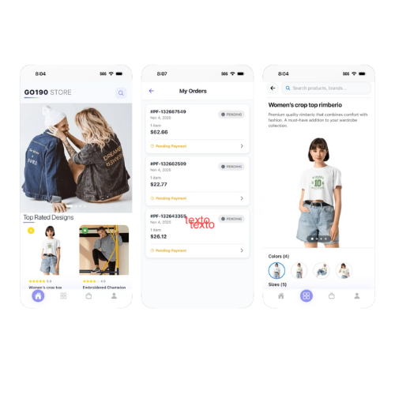
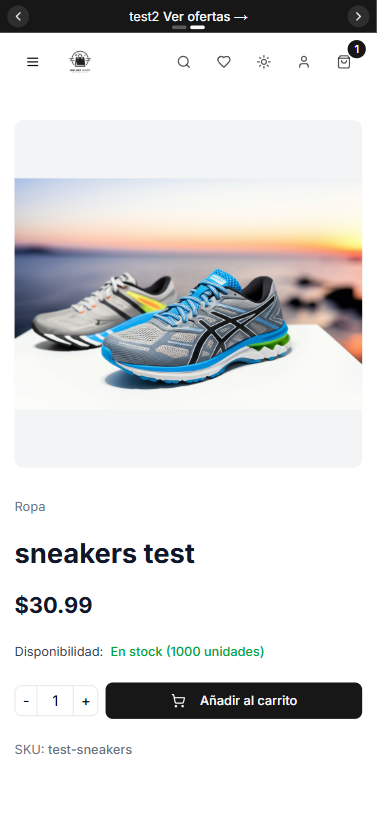
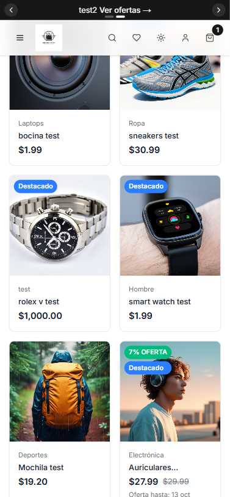
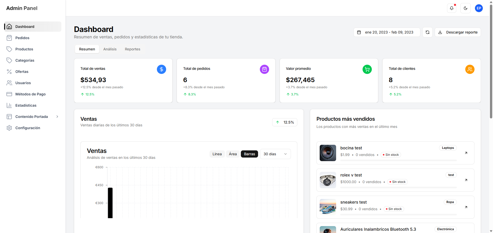
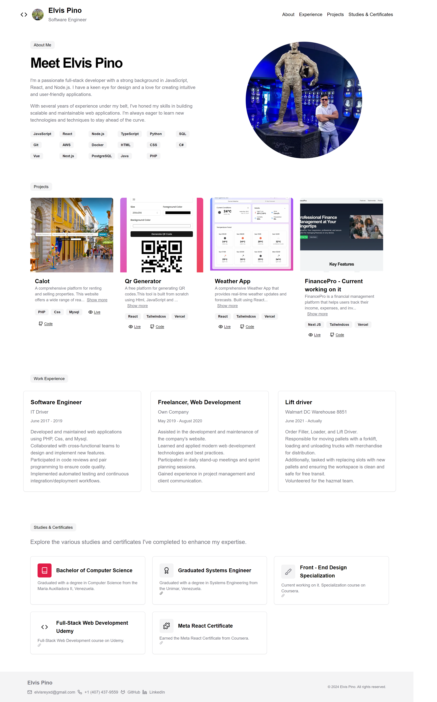
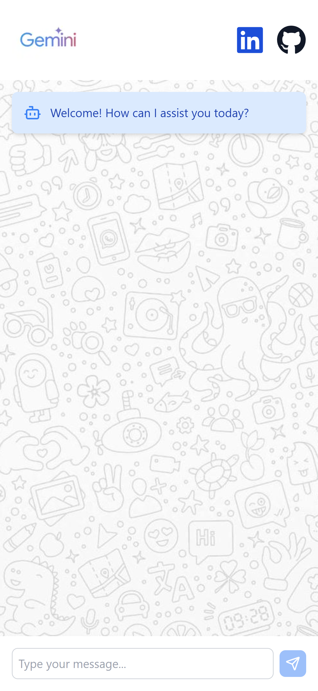
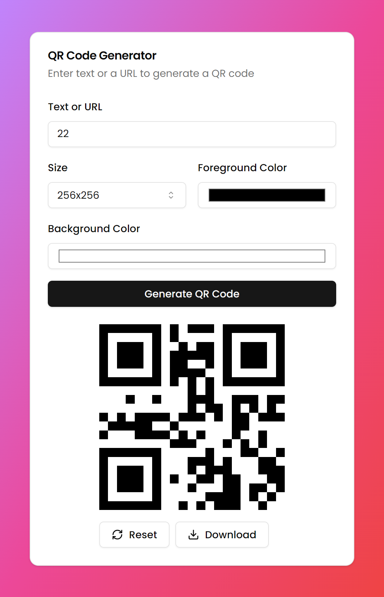
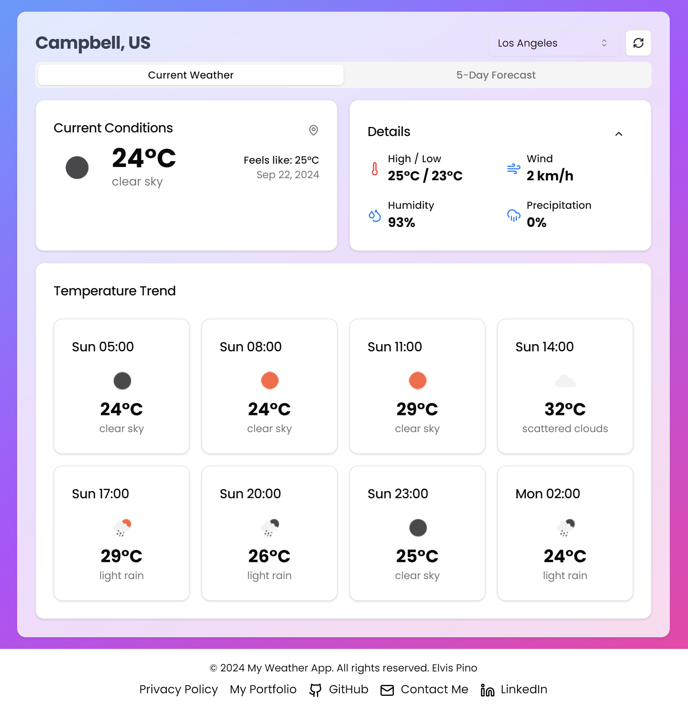

# Hello, I'm <a href="https://elvisxd.github.io/webside-curriculum/">Elvis</a> 👋

## 🚀 About Me

I'm a passionate **Full-Stack Software Developer** with a love for creating innovative digital experiences. I specialize in building modern web and mobile applications that solve real-world problems.

- ⭐ **Software Developer** with expertise in modern technologies
- 📱 **Mobile Developer** creating cross-platform applications
- 🎨 **Web Designer** with an eye for clean, responsive design
- 📚 **Technical Writer** passionate about clear documentation
- 💡 **Problem Solver** who loves tackling complex challenges
- 🌱 **Continuous Learner** always exploring new technologies

## 🛠️ Technologies & Tools

### Frontend Development

### Mobile Development

### Backend Development

### Database & Tools

### DevOps & Cloud

## 💼 Featured Projects

### 📱 GO190 Store - Complete Mobile Commerce Platform

**🔗 [iOS App Store](https://apps.apple.com/kz/app/go190-store/id6748661767)**

  

**Description:**
Full-stack mobile commerce application built with React Native, featuring a powerful NestJS backend and Next.js admin dashboard. A complete ecosystem for mobile shopping with real-world deployment on the App Store.

**Key Features:**

- Native iOS application published on App Store
- Real-time product browsing and purchasing
- Secure payment integration
- User authentication and profiles
- Push notifications for orders and promotions
- Admin dashboard for inventory and order management
- Real-time analytics and reporting

**Tech Stack:** React Native, NestJS, Next.js, TypeScript, Node.js

**Platform:** Available on iOS App Store

---

### 🛒 E-Commerce Platform - "Mi Tienda Online"

**🔗 [Live Demo](https://my-ecommerce-app-elvisxds-projects.vercel.app/)**

  
    
  

**Description:**
A complete e-commerce platform built with Next.js 15 and Supabase. Features product management, shopping cart, payment system, and admin panel. Responsive design optimized for SEO.

**Key Features:**

- Advanced product catalog with filtering
- Persistent shopping cart functionality
- Admin dashboard for product management
- Payment gateway integration
- Mobile-optimized responsive design

**Tech Stack:** Next.js 15, TypeScript, Tailwind CSS, Supabase, Vercel Blob

---

### 💰 FinancePro - Personal Finance Management

**🔗 [Live Demo](https://financepro-iota.vercel.app/)**

  

**Description:**
A comprehensive personal finance management application that helps users track income, expenses, and visualize their financial data through interactive charts and analytics.

**Key Features:**

- Income and expense tracking with categorization
- Interactive charts and financial visualizations
- Social media integration (Facebook, GitHub, LinkedIn)
- Real-time financial insights and analytics
- Secure user authentication

**Tech Stack:** React, Framer Motion, Lucide React, Tailwind CSS

---

### 🏠 Calot - Real Estate Platform

**🔗 [Visit Website](https://www.calot.com.ar)**

  

**Description:**
Full-stack real estate platform for property rental and sales. Comprehensive solution with advanced property management features and responsive design.

**Key Features:**

- Property listing and management system
- Advanced search and filtering
- User authentication and profiles
- Responsive design for all devices
- Admin dashboard for property management

**Tech Stack:** PHP (Laravel), MySQL, SQLite, CSS, Bootstrap, C#, Java

---

### 💼 Personal Portfolio

**🔗 [Live Demo](https://my-porfolio-next.vercel.app/) | [GitHub](https://github.com/elvisxd/my-porfolio-next)**

  

**Description:**
Modern and responsive personal portfolio showcasing my projects, skills, and professional experience. Built with modern web technologies and optimized for performance.

**Key Features:**

- Responsive design across all devices
- Project showcase with detailed descriptions
- Skills and technology display
- Contact form integration
- SEO optimized

**Tech Stack:** Next.js, React, Tailwind CSS, TypeScript

---

### 🤖 Gemini Chat App - AI-Powered Chat Interface

**🔗 [Live Demo](https://gemini-chat-app-three.vercel.app/)**

  

**Description:**
Interactive AI chat application built with Next.js and Tailwind CSS, leveraging artificial intelligence to provide seamless messaging experience with modern animations and responsive design.

**Key Features:**

- AI-powered conversation interface
- Smooth scrolling and animated responses
- Social media integration
- Real-time messaging
- Modern responsive design

**Tech Stack:** Next.js, Tailwind CSS, AI Integration

---

### 📱 QR Generator Tool

**🔗 [Live Demo](https://qr-generator-pp31.vercel.app/) | [GitHub](https://github.com/elvisxd/qr-generator)**

  

**Description:**
Free platform for generating custom QR codes. Built from scratch with vanilla web technologies, offering an intuitive interface for creating QR codes for various purposes.

**Key Features:**

- Generate QR codes for URLs, text, contact info
- Custom styling options
- Download functionality
- Mobile-responsive design
- No registration required

**Tech Stack:** HTML5, JavaScript, CSS3

### 🌤️ Weather App - Real-time Weather Updates

**🔗 [Live Demo](https://elvisxd.github.io/weather-app/) | [GitHub](https://github.com/elvisxd/weather-app)**

  

**Description:**
Comprehensive weather application providing real-time weather updates and forecasts. Features dynamic backgrounds that change based on current weather conditions.

**Key Features:**

- Real-time weather data
- City search functionality
- Detailed weather conditions (temperature, humidity, wind speed)
- Dynamic weather-based backgrounds
- Responsive design for all devices

**Tech Stack:** React, TailwindCSS, Weather API

---

## 📊 GitHub Analytics

  
  

  

## 🤝 Let's Connect!

---

### 💫 "Code is poetry written in logic"

_Passionate about creating innovative solutions that make a difference_ ✨

**⭐ Star my repositories if you find them useful!**

