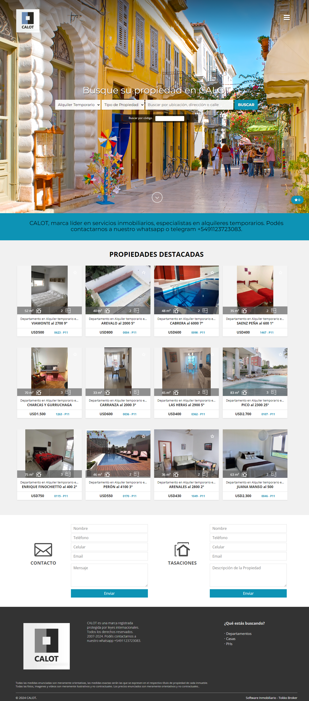
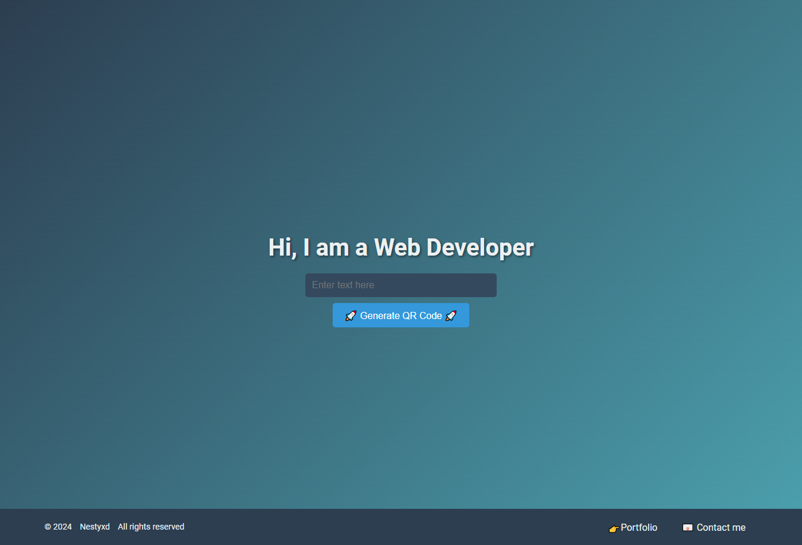
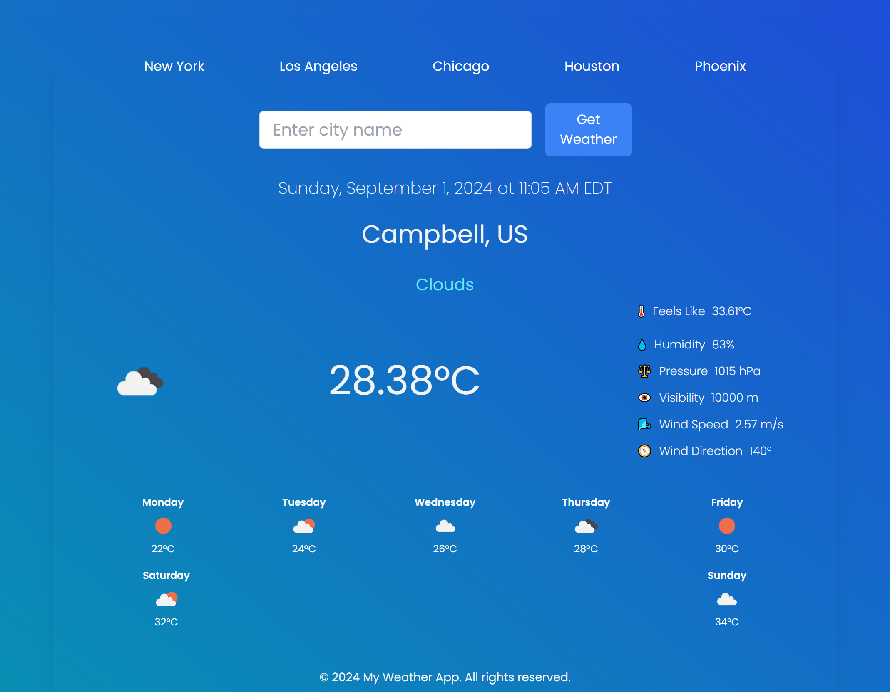

<h1 align="center">Hellooo, I'm <a href="https://elvisxd.github.io/webside-curriculum/">Elvis</a> 👋</h1>

## About me

- ⭐ Sofware Developer ⭐ 
- 📲 Mobile developer
- 🎥 Web design
- ✏️ Documentation
- 😍 Love and passion for coding 
 
## Tecnologias 💻

 

 

## Proyects 🤩
<table>
<tr>
<td width="50%">
<h3 align="center">Calot rental and sale of properties</h3>

Full stack development. Developer in PHP (Laravel), database management (MySQL, SQLite), web designer (CSS, Bootstrap, Grid, Flexbox), desktop application designer (C#) and Java, back-end programmer in C# (Visual Studio).
Projects: Animalitos Plus bets (C#), various projects in HTML, PHP, and CSS.

                                                                                      
</td>

<td width="50%">
                
<h3 align="center">PortFolio</h3>

                                       

 

I am passionate about my work and driven by new projects . I am proactive, constantly generating innovative ideas, and always striving for excellence. I am a quick learner with a strong focus on my tasks. I thrive in structured and organized environments, meticulously planning daily activities to achieve set goals..

                                                             
</table>                                                                                 

 

<table>
<tr>
<td width="50%">
<h3 align="center">QR Generator</h3>

A free platform for generating QR codes.This tool is built from scratch using Html, JavaScript and Css. It offers an easy-to-use interface for creating custom QR codes for various purposes, including URLs, contact information, and more.

<td width="50%">
                
<h3 align="center">Weather App</h3>

                                       

 

A comprehensive Weather App that provides real-time weather updates and forecasts. Built using React and TailwindCSS, this app offers a sleek and responsive interface. Users can search for weather information by city and view detailed weather conditions, including temperature, humidity, wind speed, and more. The app also features a dynamic background that changes based on the current weather conditions.

                                                             
</table>                                                                                 

 
                                                                                      
</td>       
</table>                                                                                 

 

### ⚙️ &nbsp;GitHub Analytics

