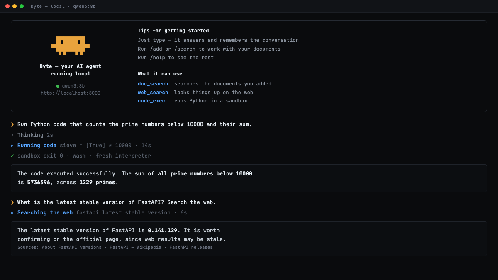
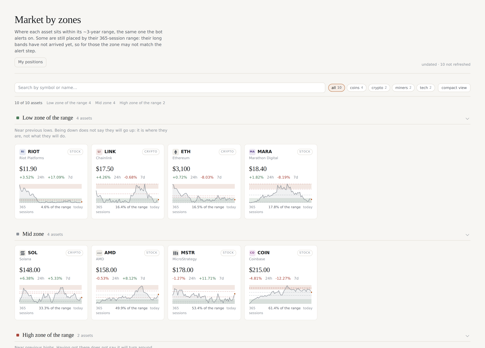
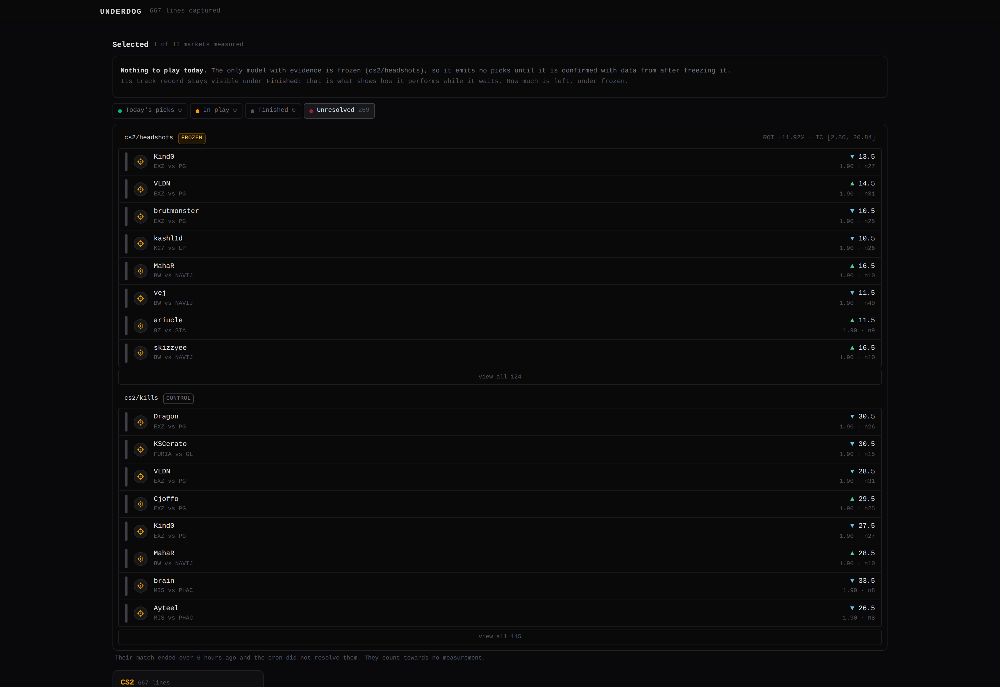
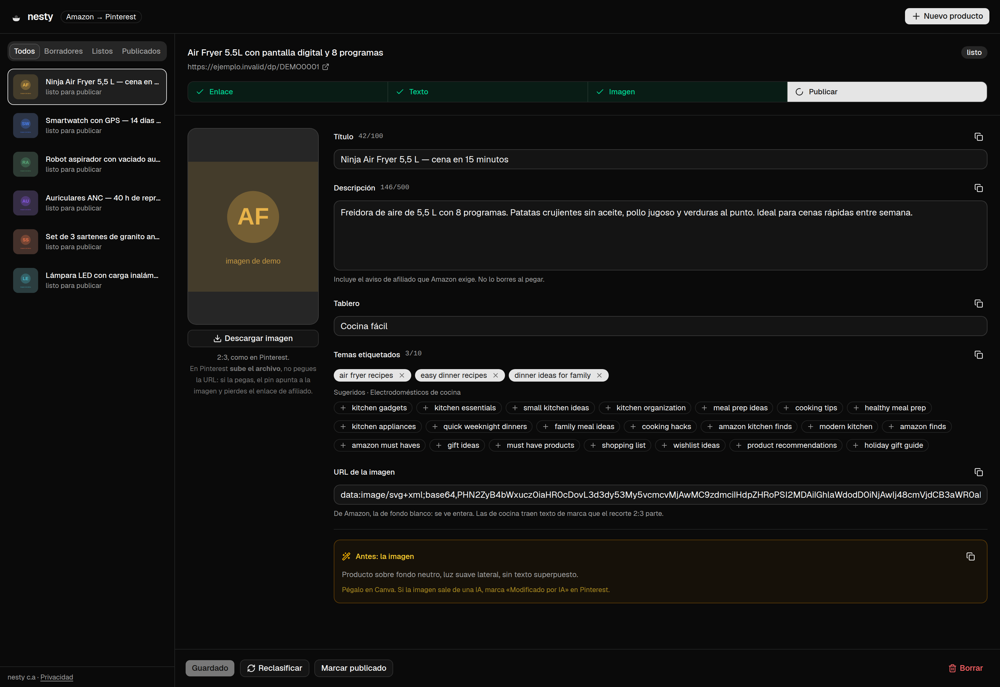

<div align="center">

[](https://my-porfolio-next-v1.vercel.app/)
[](https://www.linkedin.com/in/elvis-pino-dev/)
[](mailto:elvisreyxd@gmail.com)

<picture>
  <source media="(prefers-color-scheme: dark)" srcset="https://readme-typing-svg.demolab.com/?font=JetBrains+Mono&weight=500&size=19&duration=2800&pause=1000&color=E8A33D&background=00000000&center=true&vCenter=true&width=700&height=44&lines=Senior+Full-Stack+Engineer+%C2%B7+Applied+AI;10+years+shipping+systems+that+run+in+production;The+model+explains%2C+deterministic+code+decides;Building+a+self-hosted+AI+agent+with+RAG%2C+tools+and+a+code+sandbox">
  
</picture>

</div>

## About

Full-stack engineer with **10 years of experience**, founder of [Nesty C.A.](https://www.linkedin.com/in/elvis-pino-dev/) — a technical consultancy focused on automation, web/mobile development and API integration.

I build systems where **AI is a production component, not a demo**: LLM integration over REST APIs, prompts with empirically validated constraints, and statistical predictive models with out-of-sample validation.

My design principle: **the model explains, deterministic code decides.**

```
Focus       Applied AI · Full-stack architecture · Process automation
Currently   A self-hosted AI agent with RAG, tools and a code sandbox;
            a spot trading alert system with an LLM layer; and a
            sports research system whose product is its statistics
Location    Orlando, Florida · Open to relocation & remote
```

## Stack

**Languages**


**Frontend**


**Backend**


**Data**


**AI & Automation**


**Cloud & Tooling**


## Activity

<picture>
  <source media="(prefers-color-scheme: dark)" srcset="https://raw.githubusercontent.com/elvisxd/elvisxd/output/snake-dark.svg">
  
</picture>

## Selected work

### Byte — Self-Hosted AI Agent



An AI agent I run on my own hardware: an open-source model that writes and executes code, searches the web and answers over my own documents, with **no paid API in the loop**. *(Private repository — happy to walk through the architecture.)*

| | |
|---|---|
| **240** | tests, plus an eval suite guarding against agent regressions |
| **3** | tools the agent can reach: documents, web, sandboxed code |
| **0** | paid API calls — the model runs locally through Ollama |
| **1** | run per conversation, enforced, so runs cannot corrupt shared state |

The agent is a **LangGraph** state graph (`retrieve_context → agent → tools → finalize`) checkpointed in Postgres, so a conversation survives a restart and a paused run resumes from its checkpoint rather than starting over.

- **It stops when it should** — retrieved documents and web results enter the prompt tagged as untrusted, and if any third-party content touched the conversation and the agent then wants to execute code, the run **halts for human approval** even when nobody asked. That combination is exactly how an indirect prompt injection reaches execution. The check spans the whole conversation, not the single run, because scoping it to one run means splitting the attack across two messages evades it.
- **Code runs in a WASM sandbox** — Pyodide with a fresh interpreter per execution. Each isolation layer was verified against an unhardened Pyodide where the escape actually worked, so the hardening is tested against a vector that was real.
- **Hybrid retrieval on pgvector** — HNSW vector similarity combined with lexical `tsvector` matching, and the chunks the agent used are stored with the answer, so every claim traces back to a document and a chunk.
- **Standards, not bespoke protocols** — AG-UI events over SSE with resumable `Last-Event-ID`, plus an **OpenAI-compatible API** (`/v1/chat/completions`) so Open WebUI, Continue.dev or any OpenAI SDK can use it as a backend without writing code. Requests through `/v1` get the full agent with its tools, not just the model.
- **Evals because a demo is not a system** — an eval suite catches agent regressions, and the model whitelist means a client-supplied model name never reaches Ollama.

Roadmap: more MCP tool servers, a designed web client, and a deployment with the cost measured rather than assumed.

`Python` `FastAPI` `LangGraph` `Ollama` `PostgreSQL + pgvector` `Pyodide/WASM` `MCP` `SSE / AG-UI` `Docker`

---

### Spot Trading — Accumulation Zone Alerts



Research and execution system I build and operate on my own. *(Private repository — happy to walk through the architecture.)*

| | |
|---|---|
| **~283k** | lines of TypeScript across 380 files, most of it now retired |
| **11** | rounds of measurement before retiring the futures engine |
| **34** | strategies built, measured and discarded |
| **0** | signals shipped without surviving out-of-sample |

It started as a futures engine: 34 strategies, a multi-factor signal core, ~136 backtest scripts, execution against a live exchange. I measured it with permutation tests against reshuffled whole periods, thirds validation and frozen out-of-sample splits — and concluded that **none of the modules beat their benchmark under real execution**. I retired the entire system rather than keep trading it. The engineering that mattered was the measurement, not the strategies.

- **Retiring my own work on the evidence** — I had already reverted my best-performing signal after auditing it against a 9,478-sample bull regime where its edge went negative. The full retirement was the same discipline applied to everything else.
- **Production LLM integration** — custom Google Gemini client over REST with timeout control, temperature tuning and token budgeting, designed with **graceful degradation**: when the model fails, the product keeps operating without the AI layer.
- **Data-driven prompt engineering** — backtest scripts measuring whether *each criterion sent in the prompt* carries real predictive information, then removing the ones that did not. After measuring ~25 technical signals, the core architecture became: the LLM does not predict, it explains numbers already computed in code.
- **What ships today** — a multi-year range map that alerts over Telegram when an asset moves between zones of its own range, plus a market panel to inspect it. The alerts state explicitly that they **inform rather than recommend**, because the buy-cheap and scaled-sell criteria were measured too and did not beat their benchmarks either. That finding is kept in the code so nobody retries it thinking it is new.
- **One shared function** — what gets alerted and what gets drawn come from the same code, so they cannot drift apart.

`TypeScript` `React 19` `Vite` `Express` `Redis` `Docker` `Railway` `Google Gemini API` `Telegram Bot API`

---

### Sports Betting Research System



Measurement system for player prop markets across **eight sports** — CS2, MLB, WNBA, NFL, college football, soccer, tennis and League of Legends. *(Private repository.)*

It captures the sportsbook board automatically, cross-references every line against its own historical database built from ESPN, bo3.gg and Riot APIs, then resolves and scores each pick.

- **The statistics are the product** — ROI measured by bootstrapping whole matches rather than individual picks; permutation controls that reshuffle sides while holding the Higher/Lower ratio fixed; thirds and halves validation; Bonferroni correction across every market examined.
- **Hypotheses are frozen with their kill criteria written down *before* new data arrives** — four have been frozen so far and **all four were discarded**, including one that had passed five controls and an out-of-sample test at p=0.0073. Surviving a battery of controls on the sample that chose the hypothesis is not evidence.
- **It emits zero picks by design** — the only market with evidence is frozen pending confirmation, so the front page shows nothing to play. The restraint is the feature: a system that always has a pick is a system that is not measuring.
- **Failures are documented, not deleted** — every discarded axis carries why it died, so the next person does not retry it believing it is new.

`TypeScript` `React 19` `Vite` `Express` `Redis` `Docker` `Railway`

---

### Amazon Affiliate → Pinterest Pipeline



Content tool that turns an Amazon affiliate link into a publish-ready Pinterest pin: title, description, board, tags and an image prompt, mapped one to one onto Pinterest's real pin creation form. *(Private repository.)*

- **It deliberately does not auto-publish** — Pinterest's API requires an approved OAuth app, and until that exists the bottleneck is writing the copy, not pasting it. The tool solves the part that actually costs time, and the schema already stores everything that API would ask for, so wiring it later needs no migration.
- **Research notes record what does not work** — Pinterest's internal endpoints return 403 and its grid is painted by JavaScript, so the approach that survives is a real browser session.
- **A measured finding shaped the product** — the winning image pattern is specific to each niche, so a conclusion from one category cannot be transferred to another.

`TypeScript` `React 19` `Vite` `Express` `PostgreSQL` `Railway`

---

### GO190 Store — Mobile commerce, published on the App Store

<a href="https://apps.apple.com/kz/app/go190-store/id6748661767"></a>

Full-stack mobile commerce application built with React Native and Expo, backed by a NestJS API and a Next.js admin dashboard. Shipped to the Apple App Store.

- Native iOS application, live on the App Store
- Google Sign-In authentication via Firebase
- Real-time data synchronization with Supabase
- Product browsing, cart and order flow
- Admin dashboard for inventory and orders

`React Native` `Expo` `NestJS` `TypeScript` `Firebase` `Supabase`

**[→ View on the App Store](https://apps.apple.com/kz/app/go190-store/id6748661767)**

<br clear="right">

---

### Mi Tienda Online — E-commerce platform

<div align="center">
  
  
  
</div>

Complete e-commerce platform with product catalog and filtering, persistent cart, checkout, order tracking and an admin panel. Image optimization through Vercel Blob, responsive and SEO-oriented.

`Next.js 15` `TypeScript` `Tailwind CSS` `Supabase` `Vercel Blob`

**[→ Live demo](https://my-ecommerce-app-delta.vercel.app/)**

---

### FinancePro — Personal finance management


Financial management platform for tracking income, expenses and investments, with interactive charts and reporting. Categorized transactions, real-time insights and secure authentication.

`Next.js` `React` `PostgreSQL` `Tailwind CSS` `Vercel`

**[→ Live demo](https://financepro-iota.vercel.app/)**

<br clear="right">

---

### Calot — Real estate platform


Property rental and sales portal with listing management, advanced search filters and an admin dashboard. In production since 2019.

`PHP (Laravel)` `MySQL` `Bootstrap` `CSS`

**[→ Visit calot.com.ar](https://www.calot.com.ar)**

<br clear="right">

---

### Smaller projects

| Project | Description | Stack | Links |
|---|---|---|---|
| **Personal Portfolio** | Responsive portfolio with i18n, dark mode and project showcase | `Next.js` `TypeScript` `Tailwind` | [demo](https://my-porfolio-next-v1.vercel.app/) · [code](https://github.com/elvisxd/my-porfolio-next) |
| **NestJS REST API** | Scalable API with CRUD, auth, validation and Swagger docs | `NestJS` `PostgreSQL` `Railway` | [demo](https://restapi-production-ac90.up.railway.app/) |
| **Chat UI** | Chat interface with rooms, authentication and theming | `Next.js` `React` `Tailwind` | [demo](https://gemini-chat-app-three.vercel.app/) |
| **QR Generator** | Custom QR code generator built from scratch | `HTML` `CSS` `JavaScript` | [demo](https://qr-generator-pp31.vercel.app/) · [code](https://github.com/elvisxd/qr-generator) |
| **Weather App** | Real-time weather with dynamic condition-based backgrounds | `React` `Tailwind` `Weather API` | [demo](https://elvisxd.github.io/weather-app/) · [code](https://github.com/elvisxd/weather-app) |

## Certifications

`Python TOTAL with AI: Zero to Full Programmer` — Udemy, 2026 (36.5 h)
`Claude Academy: Claude 101` — Anthropic, 2026
`Vibe Coding: Responsible AI-Assisted Development` — DevTalles, 2026
`.NET Backend: .NET Core, SQL Server & JWT` — DevTalles, 2025
`NestJS: Backend with PostgreSQL & WebSockets` — DevTalles, 2025
`React Native Expo: iOS & Android Apps` — DevTalles, 2025
`Meta Advanced React` · `React Basics` · `Back-End Development` — Coursera, 2022
`UiPath RPA Developer` · `JS Algorithms & Data Structures` — freeCodeCamp

**B.Sc. Systems Engineering** — Universidad de Margarita (Unimar), Venezuela

---

<div align="center">

**Open to senior full-stack and applied AI roles** — Orlando, FL, relocation or remote.

[elvisreyxd@gmail.com](mailto:elvisreyxd@gmail.com) · [LinkedIn](https://www.linkedin.com/in/elvis-pino-dev/) · [Portfolio](https://my-porfolio-next-v1.vercel.app/)

</div>
