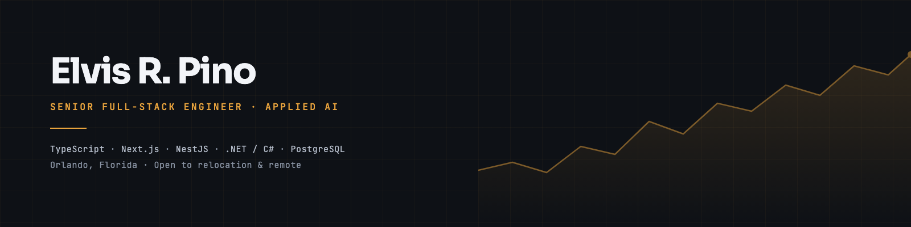
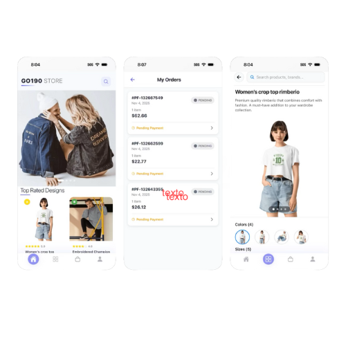
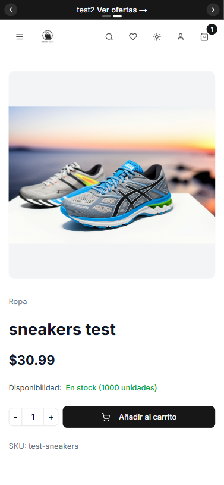
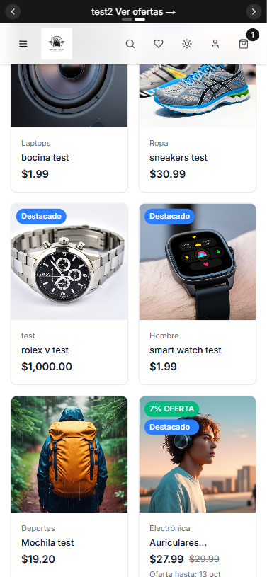
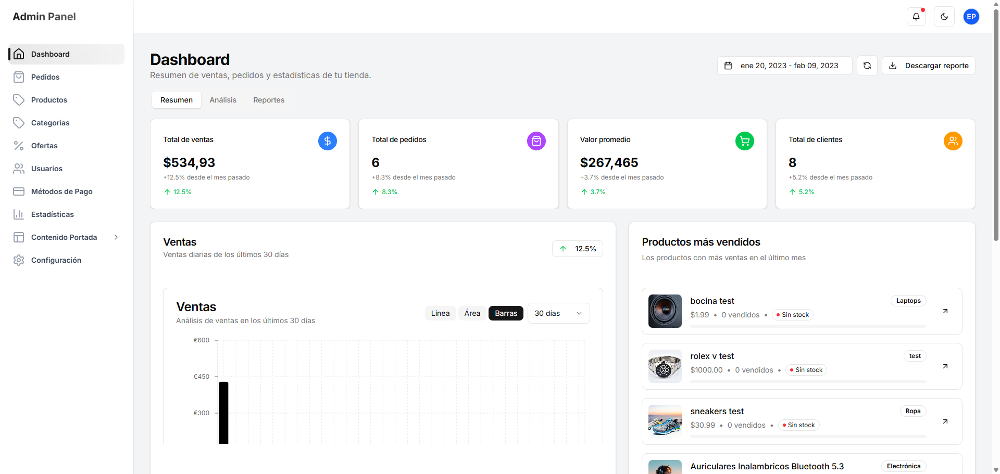
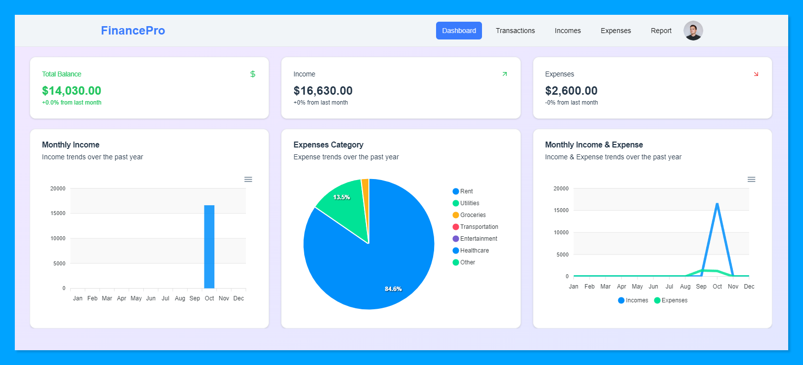
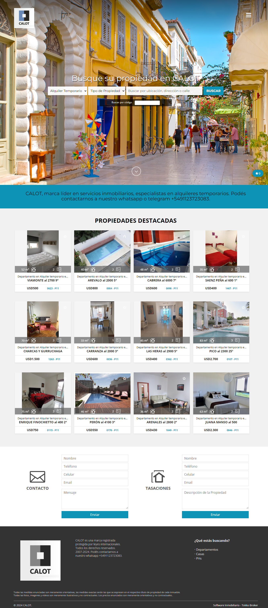

<div align="center">

[](https://my-porfolio-next-v1.vercel.app/)
[](https://www.linkedin.com/in/elvis-pino-b358b2127/)
[](mailto:elvisreyxd@gmail.com)

</div>

## About

Full-stack engineer with **10 years of experience**, founder of [Nesty C.A.](https://www.linkedin.com/in/elvis-pino-b358b2127/) — a technical consultancy focused on automation, web/mobile development and API integration.

I build systems where **AI is a production component, not a demo**: LLM integration over REST APIs, prompts with empirically validated constraints, and statistical predictive models with out-of-sample validation.

My design principle: **the model explains, deterministic code decides.**

```
Focus       Applied AI · Full-stack architecture · Process automation
Currently   Building an algorithmic trading platform and a sports
            prediction system, both with LLM and predictive layers
Location    Orlando, Florida · Open to relocation & remote
```

## Stack

**Languages**


**Frontend**


**Backend**


**Data**


**AI & Automation**


**Cloud & Tooling**


## Selected work

### Algorithmic Trading Platform — Applied AI

Independently built and operated research and execution system. My most complete work in applied AI, data engineering and real-time systems. *(Private repository — happy to walk through the architecture.)*

| | |
|---|---|
| **~283k** | lines of TypeScript across 380 files |
| **5** | independent signal engines, ~46 symbols in parallel |
| **+1.29%** | model edge, validated out-of-sample |
| **59.4%** | directional accuracy against a 50.1% base rate |

- **Production LLM integration** — custom Google Gemini client over REST with timeout control, temperature tuning and token budgeting. Five specialized prompts across three services, designed with **graceful degradation**: when the model fails, the product keeps operating without the AI layer.
- **Data-driven prompt engineering** — wrote backtest scripts measuring whether *each criterion sent in the prompt* carries real predictive information, then removed the ones that did not. After measuring ~25 technical signals, established the core architecture: the LLM does not predict, it explains numbers already computed in code.
- **Custom predictive model** — weighted voting ensemble over 5 features with a net consensus threshold and a 72-hour horizon. Validated with permutation testing, Bonferroni correction and out-of-sample splits.
- **Quantitative rigor** — reverted my own best-performing signal (+1.76% edge) after auditing it against a 9,478-sample bull regime where it produced negative edge.
- **AI observability** — the system persists every model reading and verifies its accuracy against real price data every 10 minutes.

`Next.js 15` `React 19` `TypeScript` `PostgreSQL (Neon)` `Redis (Upstash)` `Railway` `Google Gemini API` `Telegram Bot API`

---

### GO190 Store — Mobile commerce, published on the App Store

<a href="https://apps.apple.com/kz/app/go190-store/id6748661767"></a>

Full-stack mobile commerce application built with React Native and Expo, backed by a NestJS API and a Next.js admin dashboard. Shipped to the Apple App Store.

- Native iOS application, live on the App Store
- Google Sign-In authentication via Firebase
- Real-time data synchronization with Supabase
- Product browsing, cart and order flow
- Admin dashboard for inventory and orders

`React Native` `Expo` `NestJS` `TypeScript` `Firebase` `Supabase`

**[→ View on the App Store](https://apps.apple.com/kz/app/go190-store/id6748661767)**

<br clear="right">

---

### Mi Tienda Online — E-commerce platform

<div align="center">
  
  
  
</div>

Complete e-commerce platform with product catalog and filtering, persistent cart, checkout, order tracking and an admin panel. Image optimization through Vercel Blob, responsive and SEO-oriented.

`Next.js 15` `TypeScript` `Tailwind CSS` `Supabase` `Vercel Blob`

**[→ Live demo](https://my-ecommerce-app-delta.vercel.app/)**

---

### FinancePro — Personal finance management



Financial management platform for tracking income, expenses and investments, with interactive charts and reporting. Categorized transactions, real-time insights and secure authentication.

`Next.js` `React` `PostgreSQL` `Tailwind CSS` `Vercel`

**[→ Live demo](https://financepro-iota.vercel.app/)**

<br clear="right">

---

### Calot — Real estate platform



Property rental and sales portal with listing management, advanced search filters and an admin dashboard. In production since 2019.

`PHP (Laravel)` `MySQL` `Bootstrap` `CSS`

**[→ Visit calot.com.ar](https://www.calot.com.ar)**

<br clear="right">

---

### Smaller projects

| Project | Description | Stack | Links |
|---|---|---|---|
| **Personal Portfolio** | Responsive portfolio with i18n, dark mode and project showcase | `Next.js` `TypeScript` `Tailwind` | [demo](https://my-porfolio-next-v1.vercel.app/) · [code](https://github.com/elvisxd/my-porfolio-next) |
| **NestJS REST API** | Scalable API with CRUD, auth, validation and Swagger docs | `NestJS` `PostgreSQL` `Railway` | [demo](https://restapi-production-ac90.up.railway.app/) |
| **Chat UI** | Chat interface with rooms, authentication and theming | `Next.js` `React` `Tailwind` | [demo](https://gemini-chat-app-three.vercel.app/) |
| **QR Generator** | Custom QR code generator built from scratch | `HTML` `CSS` `JavaScript` | [demo](https://qr-generator-pp31.vercel.app/) · [code](https://github.com/elvisxd/qr-generator) |
| **Weather App** | Real-time weather with dynamic condition-based backgrounds | `React` `Tailwind` `Weather API` | [demo](https://elvisxd.github.io/weather-app/) · [code](https://github.com/elvisxd/weather-app) |

## Certifications

`Vibe Coding: Responsible AI-Assisted Development` — DevTalles, 2026
`.NET Backend: .NET Core, SQL Server & JWT` — DevTalles, 2025
`NestJS: Backend with PostgreSQL & WebSockets` — DevTalles, 2025
`React Native Expo: iOS & Android Apps` — DevTalles, 2025
`Meta Advanced React` · `React Basics` · `Back-End Development` — Coursera, 2022
`UiPath RPA Developer` · `JS Algorithms & Data Structures` — freeCodeCamp

**B.Sc. Systems Engineering** — Universidad de Margarita (Unimar), Venezuela

## GitHub

<div align="center">
  
  
</div>

---

<div align="center">

**Open to senior full-stack and applied AI roles** — Orlando, FL, relocation or remote.

[elvisreyxd@gmail.com](mailto:elvisreyxd@gmail.com) · [LinkedIn](https://www.linkedin.com/in/elvis-pino-b358b2127/) · [Portfolio](https://my-porfolio-next-v1.vercel.app/)

</div>
