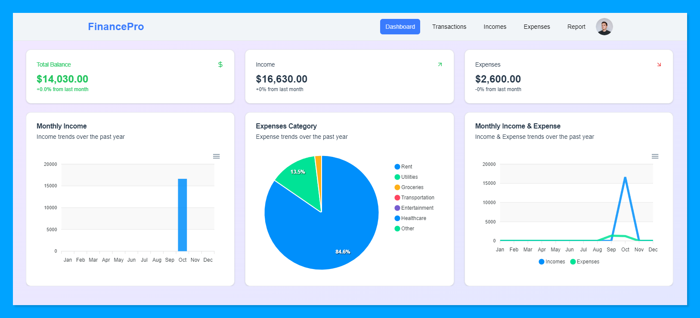

<h1 align="center">Hellooo, I'm <a href="https://elvisxd.github.io/webside-curriculum/">Elvis</a> 👋</h1>

## About me

- ⭐ Sofware Developer ⭐ 
- 📲 Mobile developer
- 🎥 Web design
- ✏️ Documentation
- 😍 Love and passion for coding

  
## technologies 💻

 

 

## Proyects 🤩

<table>
  <tr>
    <td width="100%" >
      <h3 align="center">Mi Tienda Online</h3>
      

        <a href="https://my-ecommerce-app-elvisxds-projects.vercel.app/" target="_blank">
         

  
  
  

        </a>
        

          Una tienda online completa desarrollada con Next.js 15 y Supabase. Incluye gestión de productos, 
          carrito de compras, sistema de pagos, y panel de administración. Diseño responsive y optimizado 
          para SEO.
        

        <h4>Características principales:</h4>
        

          • Catálogo de productos con filtros avanzados 
          • Carrito de compras con persistencia 
          • Panel de administración para gestión de productos 
          • Integración con pasarelas de pago 
          • Diseño responsive optimizado para móviles
        

        <h4>Tecnologías:</h4>
        

          Next.js 15, TypeScript, Tailwind CSS, Supabase, Vercel Blob
        

      

    </td>
  </tr>
</table>

<table>
  <tr>
    <td width="100%" >
      <h3 align="center">FinancePro</h3>

</a>

## Features

- **Income and Expense Management**: Record and categorize your financial transactions.
- **Interactive Charts**: Visualize your financial data with clear and detailed charts.
- **Social Connection**: Connect with us through Facebook, Github, LinkedIn, and email.

## Technologies Used

- **React**: JavaScript library for building user interfaces.
- **Framer Motion**: Library for animations in React.
- **Lucide React**: Icon set for React.
- **Tailwind CSS**: CSS framework for rapid and responsive design.
    </td>
  </tr>
</table>

 

<table>
<tr>
<td width="50%">
<h3 align="center">Calot rental and sale of properties</h3>

Full stack development. Developer in PHP (Laravel), database management (MySQL, SQLite), web designer (CSS, Bootstrap, Grid, Flexbox), desktop application designer (C#) and Java, back-end programmer in C# (Visual Studio).
Projects: Animalitos Plus bets (C#), various projects in HTML, PHP, and CSS.

                                                                                      
</td>

<td width="50%">
                
<h3 align="center">PortFolio</h3>

                                       

 

I am passionate about my work and driven by new projects . I am proactive, constantly generating innovative ideas, and always striving for excellence. I am a quick learner with a strong focus on my tasks. I thrive in structured and organized environments, meticulously planning daily activities to achieve set goals..

                                                             
</table>                                                                                 

 

<table>
  <tr>
    <td width="100%" >
      <h3 align="center">Gemini Chat App</h3>

</a>

GeminiChatApp is an interactive chat application built with Next.js and Tailwind CSS, leveraging artificial intelligence to provide a seamless and modern messaging experience. Features include smooth scrolling, animated responses, and integrated social media links, all presented in a responsive design.

    </td>
  </tr>
</table>

 
<table>
<tr>
<td width="50%">
<h3 align="center">QR Generator</h3>

A free platform for generating QR codes.This tool is built from scratch using Html, JavaScript and Css. It offers an easy-to-use interface for creating custom QR codes for various purposes, including URLs, contact information, and more.

<td width="50%">
                
<h3 align="center">Weather App</h3>

                                       

 

A comprehensive Weather App that provides real-time weather updates and forecasts. Built using React and TailwindCSS, this app offers a sleek and responsive interface. Users can search for weather information by city and view detailed weather conditions, including temperature, humidity, wind speed, and more. The app also features a dynamic background that changes based on the current weather conditions.

                                                             
</table>                                                                                 

 
                                                                                      
</td>       
</table>                                                                                 

 

### ⚙️ &nbsp;GitHub Analytics

